# Partitions

The execution order of systems is actually undefined.
Although the scheduler avoids executing systems requesting conflicting resources
from running concurrently,
it is undefined which system executes first.
For example, consider the following code:

```rust
#[global(initial = Self::default())]
struct Clock {
    ticks: u32,
}

#[system]
fn update_clock(#[dynec(global)] clock: &mut Clock) {
    clock.ticks += 1;
}

#[system]
fn render_status(
    #[dynec(global)] status: &mut StatusBar,
    #[dynec(global)] clock: &Clock,
) {
    status.set_text(format!("Current time: {}", clock.ticks));
}

#[system]
fn render_progress(
    #[dynec(global)] progress: &mut ProgressBar,
    #[dynec(global)] clock: &Clock,
) {
    progress.set_progress(clock.ticks);
}
```

It is actually possible that `render_status` is executed before `update_clock`
but `render_progress` is executed afterwards,
in which case the progress bar and the status bar have different values in the end.

To avoid this problem, we introduce *partitions*,
which can ensure some systems are executed before some others.

A partition is any thread-safe value that implements `Debug + Eq + Hash`.
Any two equivalent values (with the same type) are considered to be the same partition.
So for the example above, we can create a `ClockUpdatedPartition` type:

```rust
#[derive(Debug, PartialEq, Eq, Hash)]
struct ClockUpdatedPartition;

#[system(before(ClockUpdatedPartition))]
fn update_clock(#[dynec(global)] clock: &mut Clock) {
    clock.ticks += 1;
}

#[system(after(ClockUpdatedPartition))]
fn render_status(
    #[dynec(global)] status: &mut StatusBar,
    #[dynec(global)] clock: &Clock,
) {
    status.set_text(format!("Current time: {}", clock.ticks));
}

#[system(after(ClockUpdatedPartition))]
fn render_progress(
    #[dynec(global)] progress: &mut ProgressBar,
    #[dynec(global)] clock: &Clock,
) {
    progress.set_progress(clock.ticks);
}

// Other systems not related to `ClockUpdatedPartition`.
#[system]
fn other_systems() {}
```

Thus, `update_clock` is already executed when `ClockUpdatedPartition` is complete.
Then `render_status` and `render_progress` are only executed
after the partition is complete,
so they render the value of the updated clock.
This is illustrated by the following diagram:

```mermaid
---
displayMode: compact
---
gantt
    dateFormat s
    axisFormat %S
    tickInterval 1s
    section Worker 1
        other_systems   :0, 0.5s
        render_status   :1, 1s
    section Worker 2
        update_clock    :0, 1s
        render_progress :1, 0.5s
    ClockUpdatedPartition :milestone, 1, 1
```



In this example, Worker 1 cannot start executing `render_status`
even though it is idle,
until all dependencies for `ClockUpdatedPartition` have completed.

If the scheduler detected a cyclic dependency,
e.g. if `update_clock` declares `ClockUpdatedPartition`
it panics with an error like this:

```text
Scheduled systems have a cyclic dependency: thread-safe system #0 (main::update_clock) -> partition #0 (main::ClockUpdatedPartition) -> thread-safe system #0 (main::update_clock)
```
